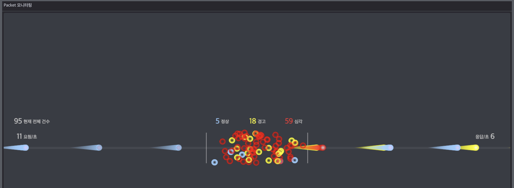

## Canvas Packet 모니터링
### __Description__

- Packet 전송 관련 화면을 Canvas로 구현하고 Webworker 사용
- Websocket API 사용하여 실시간 Packet 전송
- ES6 Class 사용

### __Screenshots__

### __Installation & Execute__
> #### Package Installation
    npm install
> #### Server
    node server.js
> #### Client
www 경로에서 다음 명령어를 수행
    
    lite-server
